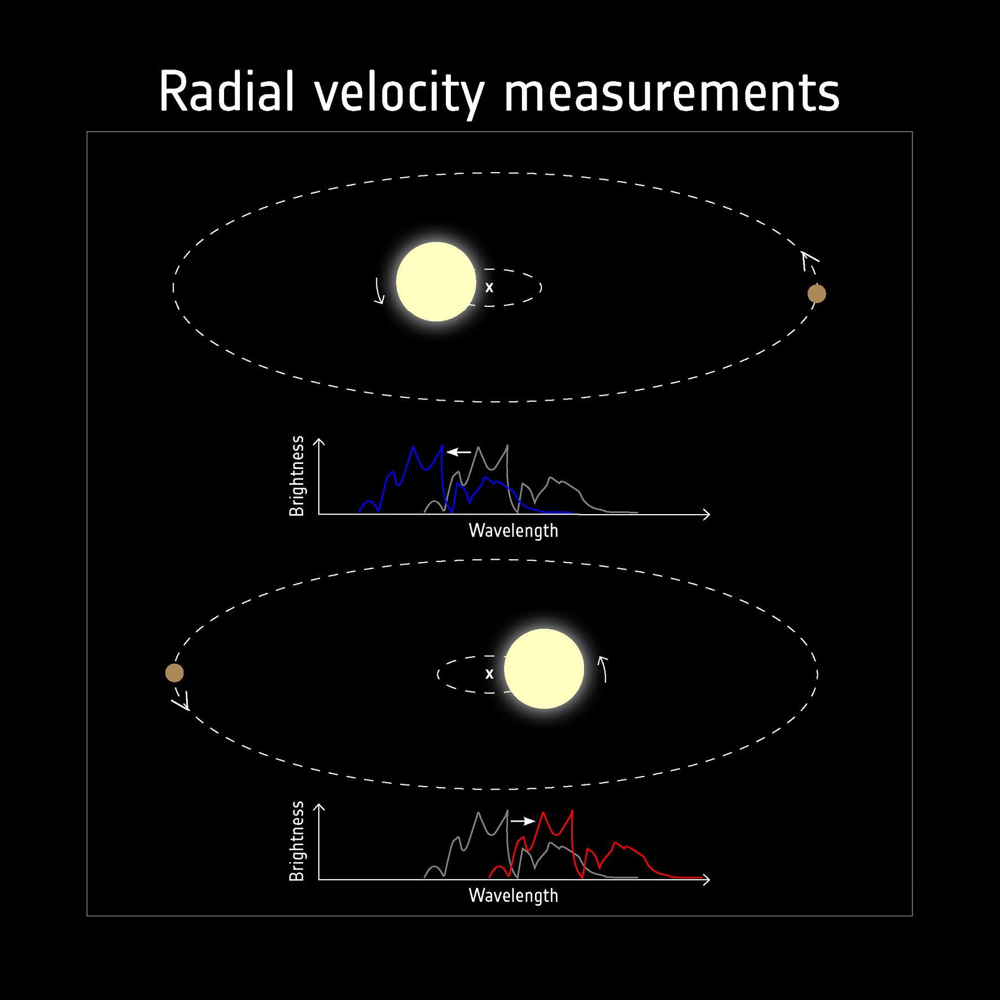
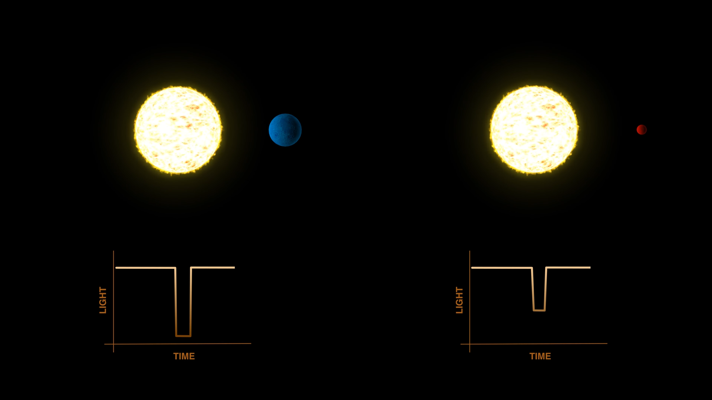

# Detection methods and processes

This document contains all required information regarding the methods of detection of exoplanets, transits, light curves, etc.

### Detection methods

Planets emit astronomically faint light compared to their host stars. It is incredibly hard to find a planet by direct imaging and the glare from the star will dominate the planet. So, to find exoplanet we use indirect methods.

Most prominent indirect detection methods are 

- Transit
- Radial Velocity
- Microlensing
- Astrometry

### Radial Velocity

Planets have relatively low mass compared to their host stars, but as per the laws of physics, two bodies attract eachother through gravitational force. The planet revolves around the star due to the stars gravity, simultaneously the star is also affected by the gravitational force of the planet and revolves around the center of mass of the system, though the orbit is very small. While the star orbits, it moves closer and away from Earth this back and forth motion causes Doppler shift in the spectra of the star.

Radial velocity method utilizes this and analyses the Doppler shift and find the planet's minimum mass. But this requires high precision measurements of the spectra and high SNR spectra for accurate measurements. So this method is best suited for stars that have low mass (measureable gravitational effect from planet), nearby stars (low noise from space). Planetary orbits with high inclinations are favourable for these measurements.

</img>

### Microlensing

Gravity bends the path of light(curves in space-time). Light coming form a star bend if another star comes in between source star and Earth, resulting in increased brightness. If there is a planet orbiting the passing star and if it is in the line of source star and Earth, the planet also causes gravitational lensing adding to lensing caused by host star. By analysing this microlensing due to the planet we can find about its existance and mass.

</img>

This method requires the planet to be in the line of sight from Earth to the source star, this method can measure planets withlow mass. But it can be observed only once as that same pass is likely to never occur again. This method can help in determining the planet's mass but not the radius, time period, etc.

### Transit Method

When a planet crosses infront of the host star (transits), it covers part of the star's light and a small dip brightness of star is observed. If the planet is big then more area is covered and more dip in brightness is observed, for smaller planets the dip is smaller, by analysing the dip we can find the radius of the planet. The ingress (first contact to second contact) is the time taken for the planet to completely enter the region of loght and egress (third contact to fourth contact) is time taken to completely move out of region of light. All this data can be found from the exoplanet's transit light curve.

But this method too has some limitations. The planet's orbit must be aligned to the line of sight of Earth and the host star, these light curves have high noise, since the dip is ver small, measured in ppm, there can be many false detections. So, another method like radial velocity is used for conformation after this.

The dip is called transit depth and is measured as the change in normalised flux of star. The light coming from the star passes also through the atmosphere of the planet, so by care fully observing the stellar spectra we can analyse about the atmosphere of the planet.

There can be **False positives** in this methods. Here, the dip in brightness resembels a planet but is not. It can be due to,

- **Eclipsing binary stars** - In a binary system, a grazing eclipse by a less brighter star or transit by a smaller star resembles the same dip as a planet.
- **Blended Eclipsing Binary** -  If there is a binary star system i the background of a star, certain brightness is observed and when the background stars eclipse eachother, the brightness dips a little resembling a planet.
- **Starspots** - Large starspots forms on star and rotate, when thet pass through in front of the observer it resembles the dip in brightness of a planet.

These false positives can be rectified by,
- Analysing the shape at the bottom of the transit, false positives have a "V" shaped transit while planet have a "U" shaped or "\\_/" flat bottom transits.
- Analysing periodic repetitions in the transits.

### Light Curves

### Noise