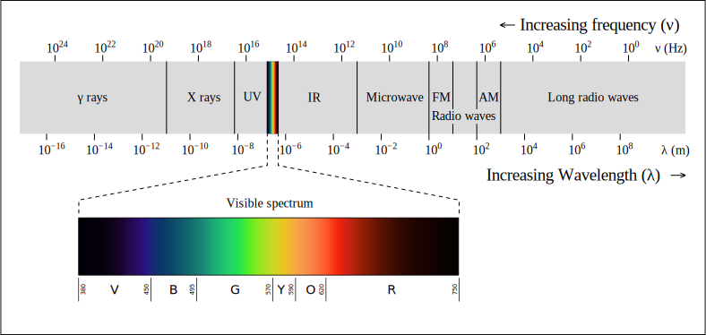
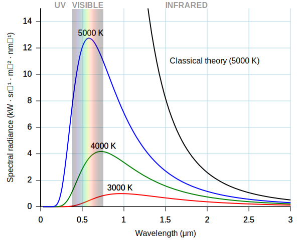

# Stars and Exoplanets

This document contains all the required knowledge about this topic like, exoplanets, etc.

### Star
A star is a luminous spheroid *(ellipsoid having two axes of equal length)* of plasma held together by self-gravity. The observable universe contains an estimated $10^{22}$ to $10^{24}$ stars.

### Stellar Parameters
Generally, stellar parameters *(like mass, luminosity, radii)* are expressed in solar units instead of SI units.
These nominal solar values are given by IAU in SI units,

|Quantity|Value|
|---|---|
|Constant of gravitation|$G = 6.67408 \times 10^{-11} m^3 kg^{-1} s^{-2}$|
|nominal solar mass|$M_\odot = 1.988475 \times 10^{30} \mathrm{kg}$|
|Nominal solar mass parameter|	$G \text{M}_\odot= 1.3271244 \times 10^{20} m^3 s^{-2}$ |
|Nominal solar luminosity|	$L_\odot = 3.828 \times 10^{26} W$ |
|Nominal solar radius| $'R_\odot = 6.957 \times10^8 m$ |

### Solar Luminosity 
The solar luminosity ($L_\odot$) is a unit of radiant flux (power emitted in the form of photons).

Astronomers use this to measure the luminosity of stars, galaxies and other celestial objects in terms of the output of the Sun.

The luminosity of a star is the amount of light and other forms of *radiant energy it radiates per unit of time*. It has units of power. The luminosity of a star is determined by its radius and surface temperature.

### Radiant Flux [Watt]
While Luminosity is energy radiated from the surface of the source, radiant flux (or radiant power) is the radiant energy emitted, reflected, transmitted or recieved per unit time, **i.e. radiant energy per unit time**. 

$$ 
\Phi_e = \frac{dQ_e}{dt}
$$

$Q_e$ is the radiant energy.

### Irradiance ($\mathrm{W \cdot m^{-2}}$)
Irradiance is the radiant flux recieved per unit area.

$$ 
 E_e = \frac{\partial \Phi_e }{\partial A} 
$$

It obeys inverse square law.

### Starspots

 Many stars do not radiate uniformly across their entire surface. Patches of the star's surface with a lower temperature and luminosity than average are known as starspots. Small, dwarf stars such as the Sun generally have essentially featureless disks with only small starspots. Giant stars have much larger, more obvious starspots.

### Magnitude

The apparent brightness of a star is expressed in terms of its **apparent magnitude [m]**, it is a function of its luminosity and distance from earth, as the intensity of radiation recieved will change with distance from source. It also depends on the extinction effect of interstellar dust and gas, and the altering of the star's light as it passes through Earth's atmosphere.

Intrinsic or **absolute magnitude [M]** is a fuction of the star's luminosity without any dependence on the distance from earth as it is the apparent magnitude if the distance is 10 parsec (32.6 light years).

Both the apparent and absolute magnitude scales are logarithmic units: one whole number difference in magnitude is equal to a brightness variation of about 2.512 times. 

this constant is taken by forming this general definition

*A difference of 5 magnitudes corresponds to exactly a factor of 100 in brightness.*

$$
x^5 = 100
$$

$$
x = 100^{1/5} = 2.511886
$$

A star with magnitude 3 is 2.512 times brighter than magnitude 4 star.

### Variable Stars

Variable stars have periodic or random changes in luminosity because of intrinsic or extrinsic properties.

Variation due to instrinsic properties :

1. **Pulsating variable stars** have periodic variation in radius, luminosity.
2. **Eruptive variables** have sudden increases in luminosity due to flares or mass ejection events.
3. **Cataclysmic or explosive variables** have dramatic changes due to explosions, sudden outbursts these include supernovae.

Variation due to extrinsic properties :
1. **Eclipsing binaries** 
2. **Rotating stars that produce extreme starspots**
3. **Exoplanet Transit**

### Electromagnetic Radiation

It is a wave of the electromagnetic field that propagates itself and carries momentum and radiant energy. In celestial objects like stars, the produced accelerated charges produce these waves at all wavelengths and frequencies.

$$
c = f \lambda
$$
where,
- $c$ is light speed
- $f$ is frequency of the radiation
- $\lambda$ is the wavelength of the radiation

Based on the wavelength and frequency EMR ranges as, 

 

### Blackbody Radiation

A blackbody (ideal body that absorbs all frequencies of radiation) emits radiation across the spectrum at thermal equilibrium.

Stars behave like black bodies and emit radiation across a continuous spectrum of wavelengths but their surface temperature decides their color.

Hotter stars emit more energy, so peak emission shift towards higher frequency. Cooler star's peak emission shift towards radiation at lower frequency.

### Photometry

It is the measurement of flux (energy per unit time per unit area) or intensity of electromagnetic radiation emitted by the celestial object.

It is measured by allowing radiation of certain frequencies through optical filters, then this radiation is captured at a detector and its intensity is recorded by turning them into measureable electric signals, through a logarithmic scale flux is transformed into magnitude.

Filters allow a specific band of frequencies and stop other frequencies to decrease noise at the detector.

This is one of the methods used for the observation of variable stars. When the brightness (magnitude or flux) is ploted against time we get a **light curve**.

These light curves can tell about the minute changes in the magnitude of the star.

### Noise

Noise refers to any unwanted variation in measured brightness, that can be caused by,
- **Photon noise** (Caused due to random nature of arrived photon)
- **Detector noise** (Detector imperfections, Electronic fluctuation,...)
- **Background noise** (Light from nearby stars, sky)
- **Systematic noise** (Temperature changes,...)
- **Stellar noise** (Starspots, Flares)

## Exoplanets

An exoplanet or extrasolar planet is a planet outside the Solar System. 

